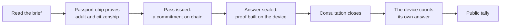

# midnight.vote

**Understand more. Disclose less. Participate as yourself.**

[](https://github.com/tomasgarro/midnight-vote/actions/workflows/test.yml)
[](LICENSE)

midnight.vote is a civic consultation app built on [Midnight](https://midnight.network). A person proves, from the chip of their passport, that they are an adult, and gets a pass with no name on it. With that pass they answer a consultation once. The count is public and anyone can check it on chain. The operator never receives the person's name or document number, so there is no list of who answered.

[Try it](https://midnight.vote) · [Public docs](https://midnight.vote/docs) · [How it works](docs/HOW-IT-WORKS.md) · [Run it locally](docs/QUICKSTART.md) · [All documentation](docs/README.md)

## Contents

- [What it does](#what-it-does)
- [Where it stands](#where-it-stands)
- [Live on Midnight Preview](#live-on-midnight-preview)
- [How an answer travels](#how-an-answer-travels)
- [What is private, and what is not](#what-is-private-and-what-is-not)
- [Repository](#repository)
- [Run and verify](#run-and-verify)
- [Documentation](#documentation)

## What it does

| | For the person | For whoever asks the question |
| --- | --- | --- |
| **Understand** | A short brief of the question, each sentence tied to its official source. Cleisthenes, the app's guide, sets out each side and never says how to answer | A consultation people can read before they answer |
| **Prove** | The passport's chip proves an age and a citizenship. The name and the document number are not sent to the service | Answers from verified adults, one per passport |
| **Answer** | The answer is sealed on the person's own device and counted after the consultation closes | A public count, a result anyone can check, and no personal data to store |

Consultations are non-binding. The app works in English, Spanish and French, and has three destinations: **Consultations**, **Cleisthenes** and **You**.

## Where it stands

State on 2 October 2026.

| Part | State |
| --- | --- |
| Contracts (`credential-registry-v1`, `referendum-v2`, in Compact) | Deployed on Midnight Preview. Compiled and simulator-tested in CI |
| A consultation's whole life on chain | Rehearsed on Preview: sealed, closed, counted and finalized |
| Credential service and relay | Rehearsed on Preview end to end, with a stand-in for the passport scan. Published as pinned images; not yet switched on at `midnight.vote` |
| Proofs built on the person's device | Working in the browser. Measured on a laptop; a phone is not measured yet |
| One answer per passport | Enforced by the credential service and the contract ([ADR-012](docs/adr/ADR-012-one-holder-per-document.md)). Rehearsed on Preview; not yet observed with a real document |
| Midnight Passport | Sign-in with a Passport account works ([first real session](docs/evidence/passport-live/2026-08-31-first-real-session.md)). Passport cannot hold a credential yet; a [proposal for an external issuer](docs/proposals/PASSPORT-ISSUER-PROPOSAL.md) is drafted |
| Cleisthenes | The guide answers from an authored catalogue, not a generative model. A consultation shows a reviewed, sourced brief once its evidence is connected |
| The public site | A working demo with simulated passes and receipts, clearly labelled |
| **An answer sealed and counted by a real person with a real passport** | **Not yet.** This is the next milestone |

Every claim above has a dated record under [docs/evidence](docs/evidence/preview-2026-10-02/README.md), which also names what was not observed.

## Live on Midnight Preview

| Contract | Address | Deployed |
| --- | --- | --- |
| `credential-registry-v1` | `9f8fe7c54d9907543cbcde82943c2be35ccb20f404e477ca2c29b8fc84a52132` | 2 September 2026, block 683016 |
| `referendum-v2`: "Should the result of a consultation stay hidden until it closes?" | `862387442d89fc422fc93ae44d3e77c8c7dfaaeba76bc0cf7dc4e52f823a26f4` | 2 October 2026, block 1113403 |

The consultation takes answers until 9 October 2026, 16:00 UTC, from any adult with a passport read by its chip.

Check either address against the network's own indexer, not against this repository:

```bash
curl -s https://indexer.preview.midnight.network/api/v4/graphql \
  -H 'content-type: application/json' \
  -d '{"query":"{ contractAction(address: \"862387442d89fc422fc93ae44d3e77c8c7dfaaeba76bc0cf7dc4e52f823a26f4\") { __typename transaction { hash block { height } } } }"}'
```

Six rehearsal consultations stand beside it, each taken to a final tally by the operator, without a passport and without a person. Their addresses, blocks and transaction hashes are in the [evidence record](docs/evidence/preview-2026-10-02/README.md#rehearsal-contracts).

| Rehearsal | What it showed |
| --- | --- |
| [A consultation from seal to final tally](docs/evidence/preview-2026-10-02/REHEARSAL.md) | The five transactions of a consultation's life |
| [A pass answering after the registry moved on](docs/evidence/preview-2026-10-02/REHEARSAL-2.md) | The proof is built against the newest admitted root that holds the pass |
| [The credential service and the relay, three runs](docs/evidence/preview-2026-10-02/DRESS-REHEARSAL.md) | Passes issued on chain and answers sealed with the service's permission; a page dropped mid-way; one document refused on a second device |

## How an answer travels



| Step | Who does it | What goes on chain |
| --- | --- | --- |
| Verify | The RariMe app reads the passport's chip and builds a zero-knowledge proof | Nothing on Midnight |
| Issue the pass | The credential service checks the proof and adds a commitment to the registry | A commitment. No name, no document number |
| Seal the answer | The person's browser proves that it holds an admitted pass, and commits to an answer | A nullifier and a commitment. Not the answer |
| Count | After the close, the same browser opens its commitment | The answer, which the tally adds |

A relay pays the network fee, so the person needs no wallet and no tokens.

## What is private, and what is not

| Kept from everyone | Public |
| --- | --- |
| Who answered. The registry holds commitments, and nothing on chain ties an answer to a pass | That an answer was sealed, and when |
| The name and document number, which never reach the credential service | The pass's country and age class, to the credential service |
| The answer, until it is counted | **The answer once it is counted.** The contract uses commit and reveal: counting publishes the choice, though not who made it |

Five limits are stated plainly, because the project depends on being believed:

- A passport proves a document. It does not prove residence, the right to vote, or that nobody is watching.
- The credential issuer and the root publisher are trusted roles. The issuer could issue a pass that no passport backs; an auditor could detect it, and the chain does not prevent it.
- The operator's services see more than the chain shows. The credential service signs the permission the relay asks for, so the operator could tie a sealed answer to a pass. A pass carries no name. A blind permission would remove that link; it is not built.
- A pass lives in one browser. It cannot move to another device, and a browser that clears its storage loses it.
- Signing in, holding a pass and being eligible are three different things. A Passport session is not permission to answer, and a pass for one consultation's rule says nothing about another's.

The [Compact review](docs/COMPACT-REVIEW-2026-09-16.md) and the [decision records](docs/README.md#architecture-decisions) give the reasoning and the remaining risks.

## Repository

| Directory | Responsibility |
| --- | --- |
| [`contracts/`](contracts/) | The Compact contracts: the credential registry and the consultation |
| [`api/`](api/) | Domain interfaces, witnesses, and the adapters that build proofs and transactions |
| [`ui/`](ui/) | The app: consultations, the passport journey, sealing and counting on the device |
| [`cico-service/`](cico-service/) | The credential service: checks a verification, issues the pass, publishes registry roots |
| [`relayer/`](relayer/) | Pays for and submits a person's proven transaction |
| [`scripts/`](scripts/) | Deployment, rehearsals, and checks of the running services |
| [`deploy/`](deploy/) | Server manifests, pinned by image digest |
| [`docs/`](docs/) | Specifications, decision records, reviews and dated evidence |

## Run and verify

A clean build needs Linux or WSL, Node from [`.nvmrc`](.nvmrc), npm 10 and the Midnight Compact toolchain 0.31.1, because generated contract assets are not tracked. The demo needs no wallet, no funds and no document.

```bash
git clone https://github.com/tomasgarro/midnight-vote.git
cd midnight-vote
nvm use && npm ci

npm run validate:contract                           # compile the contracts, run the simulator tests
npm run build --workspace midnight-referendum-api
npm test                                            # every unit suite

VITE_APP_MODE=demo npm run build --workspace midnight-referendum-ui -- --mode demo
npm run preview --workspace midnight-referendum-ui -- --host localhost --port 4173 --strictPort
```

Open `http://localhost:4173`. The [quick start](docs/QUICKSTART.md) has the walkthrough and troubleshooting.

| To check | Run |
| --- | --- |
| Everything CI checks, on Linux or WSL | `npm run verify:linux -- demo` |
| The browser journeys | `CI=true npm run test:e2e` |
| The services behind `midnight.vote`, from outside, without any secret | `npm run check:preview` |
| The whole journey on Preview without a passport | `npm run rehearse:dress`, described in the [Preview runbook](docs/PREVIEW-RUNBOOK.md#rehearse-without-a-passport) |

## Documentation

| If you want | Read |
| --- | --- |
| The idea, and where it is going | [Vision](docs/VISION.md) · [Roadmap](docs/ROADMAP.md) · [Business model](docs/BUSINESS-MODEL.md) |
| How it works, without the code | [How it works](docs/HOW-IT-WORKS.md) · [Passport and proofs](docs/PASSPORT-AND-PROOFS.md) · [Glossary](docs/GLOSSARY.md) |
| The design, and why | [Architecture](docs/ARCHITECTURE.md) · [Decision records](docs/README.md#architecture-decisions) · [Compact review](docs/COMPACT-REVIEW-2026-09-16.md) |
| The guide and the brief | [AI and deliberation](docs/AI-AND-DELIBERATION.md) · [Cleisthenes, the companion](docs/COMPANION.md) |
| What was observed on chain | [Preview evidence, 2 October 2026](docs/evidence/preview-2026-10-02/README.md) |
| To operate it | [Preview runbook](docs/PREVIEW-RUNBOOK.md) |
| To review the submission | [Submission brief](docs/SUBMISSION.md) · [Product specification](docs/specs/PRODUCT-SPEC.md) |

Changes start with a [small specification](docs/specs/CHANGE-TEMPLATE.md) and follow the [contribution guide](CONTRIBUTING.md).

## License

[Apache 2.0](LICENSE).
