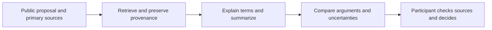

# Understanding before participation

[Documentation](README.md) · [Vision](VISION.md)

Deliberative democracy requires more than recording a preference. People need to understand the issue, examine evidence, recognize tradeoffs and understand why someone else might disagree. midnight.vote's AI vision is to turn dense public material into accessible, useful context while leaving the decision with the participant.

## Today: a catalogue guide, and a place for sourced briefs

Cleisthenes is the guide of the app and one of its three destinations. In his chat he returns authored answers from the published consultation catalogue, with contextual suggestions and source links. The chat does not browse the web or call a generative model, and it says so.

A consultation page can show a brief from the Cleisthenes service: what is asked, what Parliament decided and what was argued, each sentence tied to its source, reviewed by a named person. The app asks for a brief with the consultation, a language and the question, and with nothing about the person ([COMPANION.md](COMPANION.md)). No consultation on the public site is connected to a brief yet.

Civic Pulse is a reflection experience outside the three steps of a consultation. No screen links to it; it is kept at `/#app/pulse`. Drafts stay in component memory by default. Participants can explicitly save, review or delete a reflection in browser localStorage; anyone using that browser profile can read a saved reflection. A separate copy-prompt action lets the participant take answers to an external AI service, which shares those answers with that service if pasted there. The app does not upload them automatically. It is not a submitted ballot, a public opinion poll or a training-data collection feature.

## Next: briefs for real consultations

Useful capabilities include plain-language proposal summaries, explanations of unfamiliar terms, side-by-side arguments, multilingual access and follow-up questions grounded in cited public material. The Swiss federal votes are the starting point: Cleisthenes already explains them at `/Switzerland`, from the parliamentary record.

## Requirements before enabling generative AI

| Requirement | Acceptance evidence |
| --- | --- |
| Traceable claims | Every substantive factual answer links to supporting sources and their dates. |
| Faithful summaries | Evaluation checks numbers, quoted positions, omissions and source entailment. |
| Uncertainty | Unsupported questions produce an explicit limitation or abstention. |
| Fair treatment | Evaluate competing positions and avoid presenting a model's preference as a civic recommendation. |
| Participant privacy | Document model/provider data flows, retention and consent; keep identity evidence and private ballot material out of prompts. |
| Untrusted source handling | Retrieved text cannot override system instructions or authorize actions. |
| Human agency | The assistant cannot cast a ballot or convert a conversation into a vote. |

No deployed generative capability or evaluation score is claimed by this submission.

## Midnight.city and agents

AI agents participating in Midnight.city are an exploratory direction. Potential research includes comparing simulated deliberation, testing proposal explanations and observing how agent behavior differs from human participation. No live Midnight.city agent-voting integration is submitted here.

Agent results must use a separate actor lane, explicit provenance and separate displays. They must never be merged into verified-human vote totals or substituted when human results are unavailable. The existing [actor-lane decision](adr/ADR-008-civic-pulse-and-actor-lanes.md) and consultation interfaces provide a foundation for that separation.
